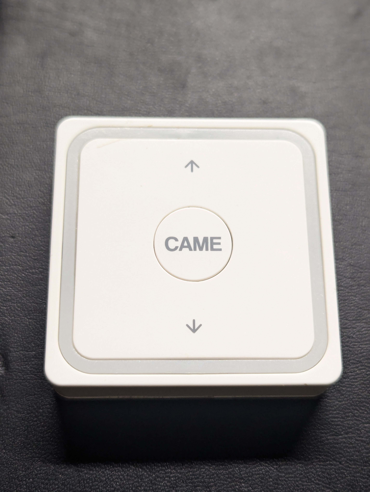
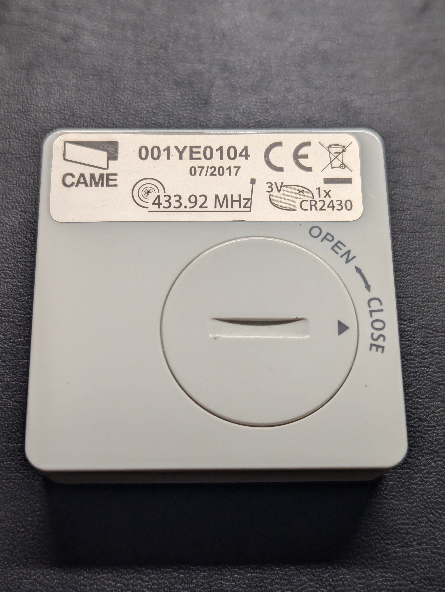
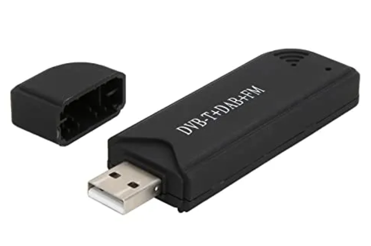
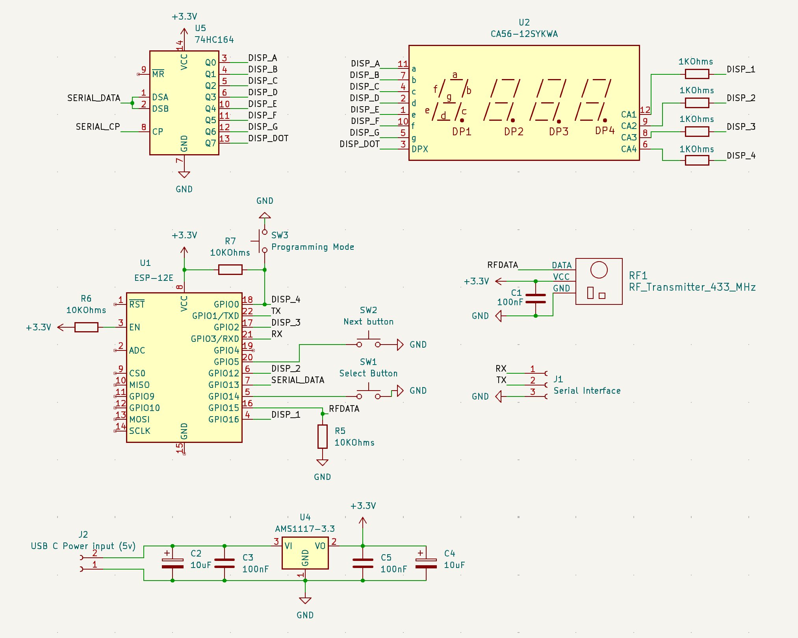
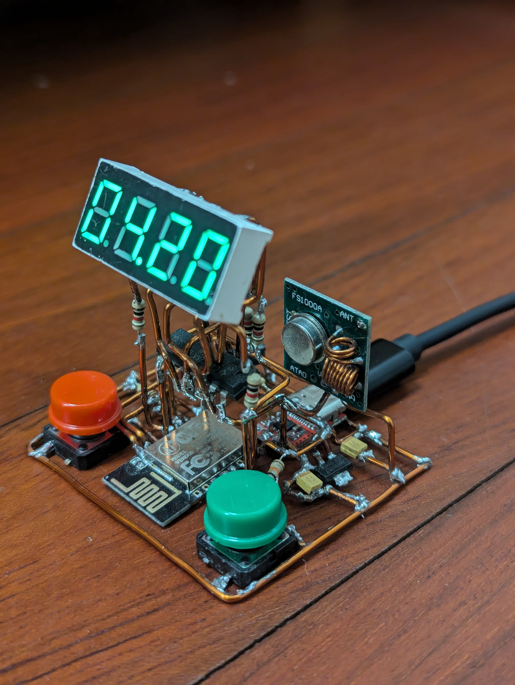
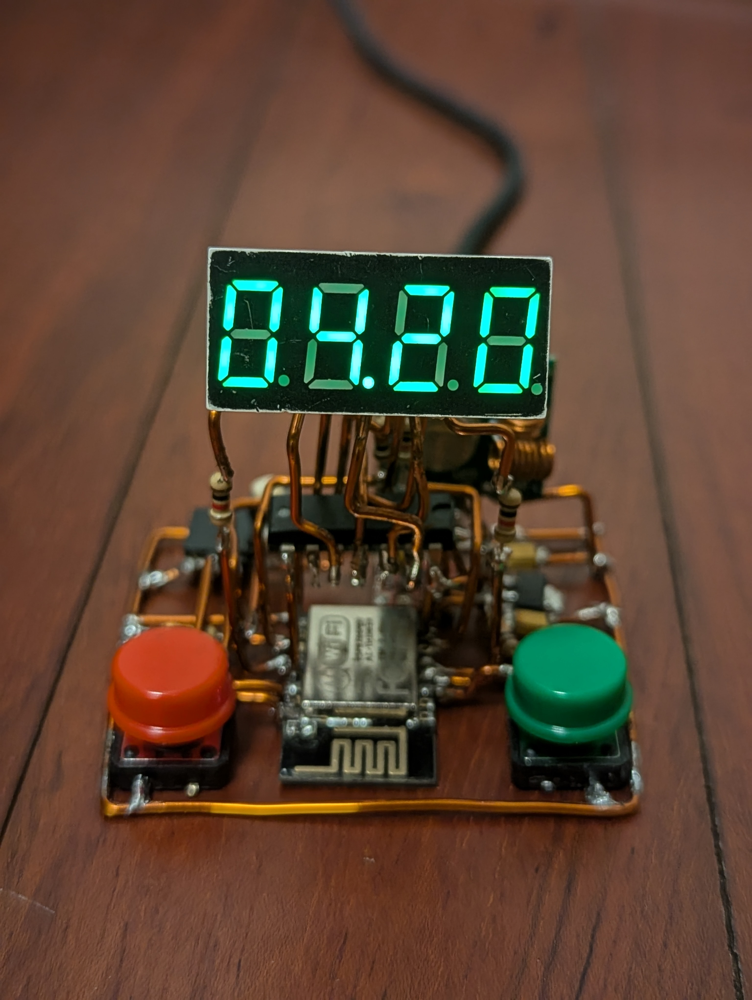
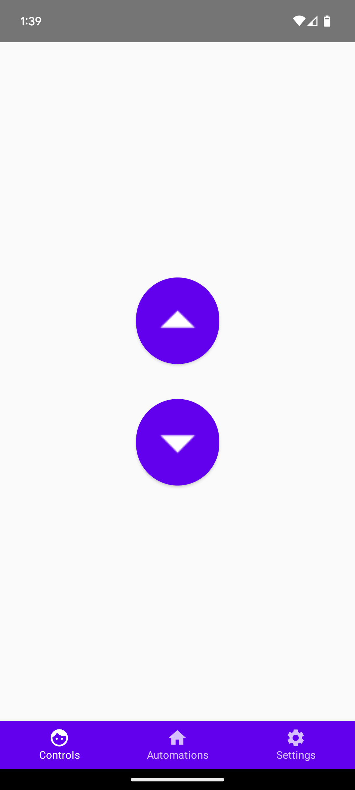
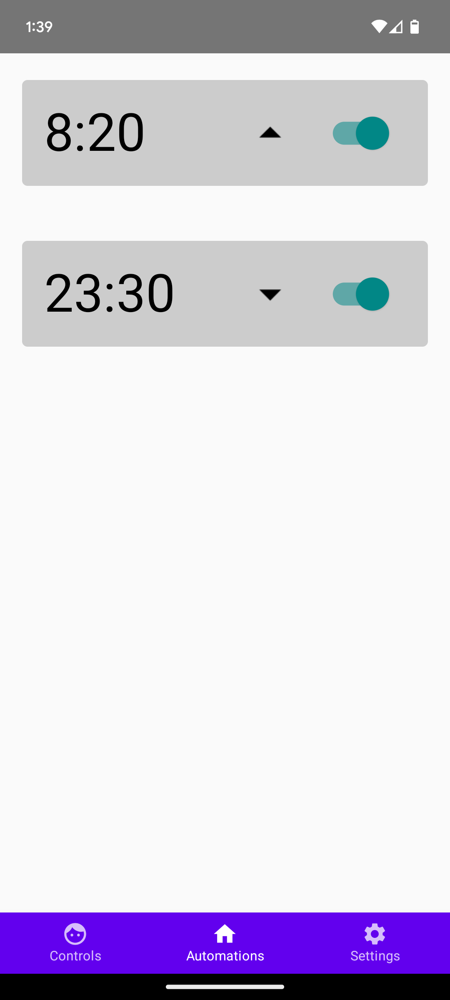
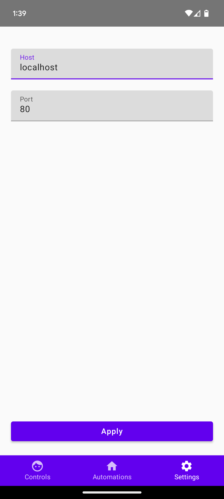

> [!WARNING]  
> **I did this for fun. If you are considering doing something similar, I suggest you to use [Home Assistant](https://www.home-assistant.io/)**

In my apartment, I have three motorized shutters, each operated by its own RF remote. Each remote allows you to:
- Raise the shutters
- Lower the shutters
- Stop the shutters at any position, allowing partial opening, such as half-raised.

    

Because it's noisy outside and I prefer to sleep in complete darkness, I lower the shutters every night and raise them when I wake up. However, using three separate remotes for this is quite frustrating. It would be great to have a single remote that operates all the shutters simultaneously. Even better would be the ability to schedule when the shutters should raise and lower automatically.

The remotes operate at 433 MHz, a common frequency for many home appliances. These signals can be captured using a DVB-T USB stick combined with SDR (Software Defined Radio) software, such as the [Universal Radio Hacker app](https://github.com/jopohl/urh). If you're interested in learning how to capture these signals, [this video tutorial](https://youtu.be/_GCpqory3kc?si=iE1ro4G0PNbSFqsl) provides a great step-by-step guide.

  
   
  <i>I used this Digital TV receiver sitck</i>
  

 

#### Project Overview

I wanted to build a device with the following functionalities:
- Lower the shutters
- Raise the shutters
- Set a time to lower the shutters automatically
- Set a time to raise the shutters automatically
- Display the current time

#### Materials Used
- 4-digit 7-segment display
- 3 x 10kΩ resistors
- 4 x 1kΩ resistors
- 100nF capacitor
- RF Transmitter module
- ESP8266 microcontroller
- AMS1117 voltage regulator
- 2 x 10µF capacitors
- 2 x 100nF capacitors
- USB C connector for power input (5v)
- RTL-SDR USB stick 

#### Circuit Diagram
Here's the scheme:

  

 

I attempted to create a freeform circuit sculpture, which turned out to be a pain in the ass:

   

   

Operating the device using the buttons may not be the most convenient option, but it's still a useful feature to have. Additionally, the device can be controlled through an app I developed using Compose Multiplatform. The app is currently working on Android and is expected to run on iOS as well, though testing on iOS is still pending.

      
      
      

#### Next setps
- [ ] Test the app in iOs.
- [ ] Improve the UI/UX of the app.
- [ ] Add stop button to the app.
- [ ] Support a weekly schedule of alarms.